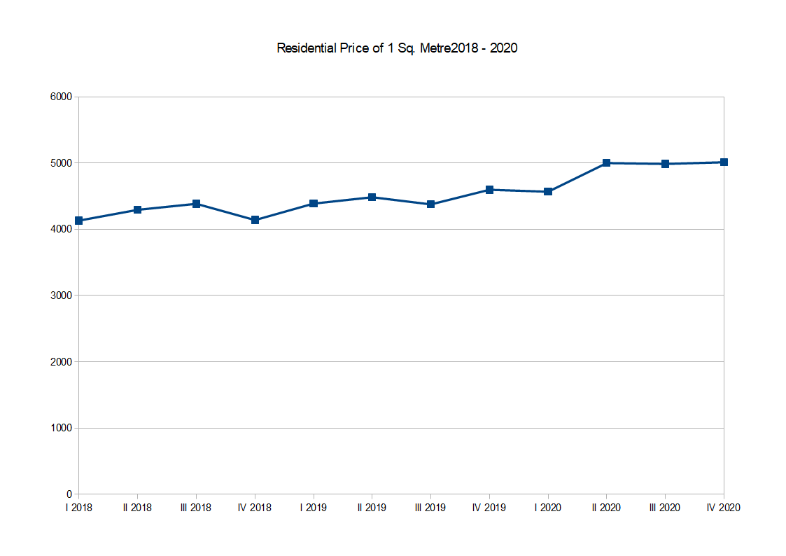
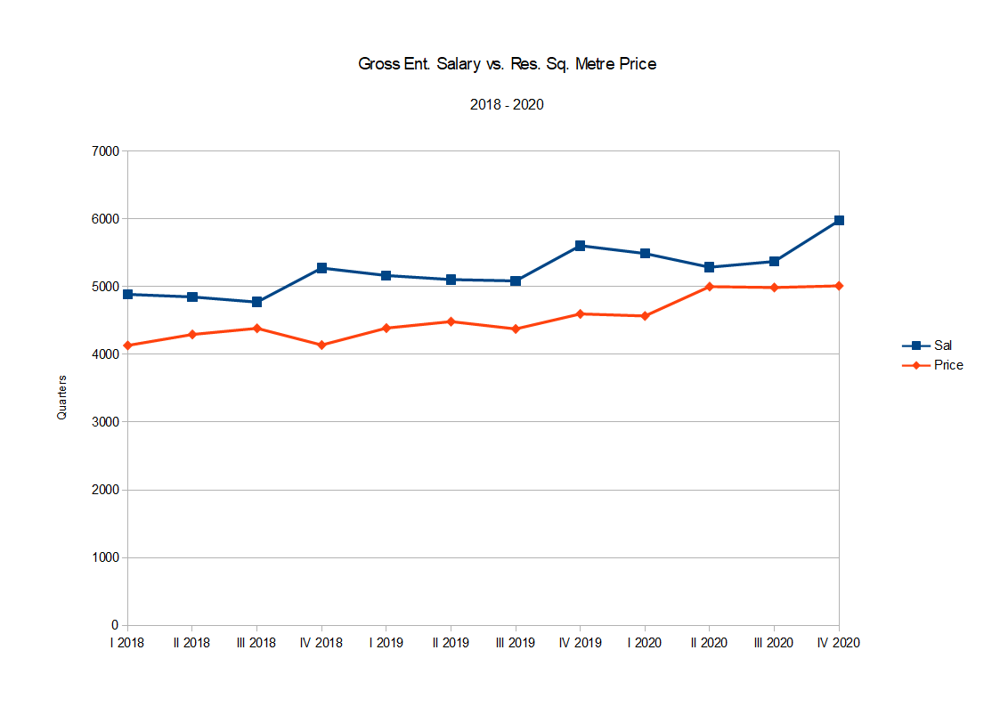

After almost twelve months of lockdowns, mask wearing and isolation where has the Polish property market been and where might it be going?

Further to our recent report [Polish Property & Mortgage Market 2021 - The Expert View](https://blog.bigdoor24.pl/posts/2021-02-09-polish-property-mortgage-market-2021-the-expert-view.html) , we now look at some of the numbers underpinning the Polish property market.

The following is a chart detailing the price of one residential square metre per quarter (2018 - 2020). (Source - stat.gov.pl).

Anyone reviewing this chart would be forgiven for thinking there was absolutely no disruption to the economy in the last year. Certainly price rises have slowed in the last three quarters but they have not collapsed as might have been expected.

##### **So what's going on?**

It depends on the question we ask. If we simply ask why prices are not rising at the same rate as before then the obvious answer is the uncertainty and disruption of 2020. If we ask the question , why did prices not fall?, we need to look at a number of different factors.

Demand certainly seized up in the first half of the year but as people adjusted to the new normal, buyers re-entered the market and banks resumed lending, albeit with adjustments to risk premiums and calculations.

If we show enterprise salary growth for the same period, side by side with property prices we can begin to see some correlation. (Source - stat.gov.pl)

Whilst there is no direct correlation on a quarter by quarter basis it is fair to say that rising salaries eventually feed into property prices. 

The main reason, however, for the sustainability of the property market, something seen across Europe, has to be the reduction in Polish mortgage interest rates. 

##### **Cheaper mortgages increase demand**

On February 2020 the National Bank of Poland reduced their long-standing reference rate from 1.5% to 0.10%. They have[ since said that they intend to keep these rates](https://polandin.com/52154559/no-change-to-interest-rates-likely-national-bank-of-polands-head?fbclid=IwAR24ma38M-Q6ncn9fbZ-BdgVW2IZVH-l-gs5mJeCuV1yByuipzHhC3dqVoA) at these levels amid a global conversation about the possibility of negative interest rates.

In real terms this means that existing mortgage holders of say a zl. 500,000 credit require approximately zl. 600 less per month in repayments. New applicants for mortgages would also find that the calculation of how much they can borrow is also higher as their "ability to repay" evaluation has been increased.

In addition to this we would expect access to the required cash deposit available to more people as savings levels have substantially increased during lockdowns.

##### **Inflation**

Another impetus to buyers has to be the fear of increasing inflation. Inflation is of particular concern in Poland when compared with Europe overall and has been growing for years. Increasing inflation reduces the value of cash. This is a simple fact. It also reduces the value of mortgage debt over time. As such, property buying as a protection against inflation is not something we see decreasing anywhere for the next few years. 

***[Did you know?](https://bigdoor24.pl/)***

***[BigDoor24.pl sends you a zl. 250 retail voucher of your choice for every successful Polish Mortgage Applicant referred - (in addition to what we send them) - register now for your personal referral code.](https://bigdoor24.pl/)***

##### **What does this tell us for the future?**

Generally, across Europe, we would be very hesitant to forecast the future as the uncertainty in the economy continues. Poland, however, seems to have weathered the pandemic relatively well, to date,  and this is reflected in recent GDP numbers. 

The factors that drive property price increases seem to be still quite strong. We are seeing changes to the type of properties people are buying but demand remains in place with pressure really only being seen in the supply. If we imagine that the worst effects of the pandemic are behind us, then indications for the value of Polish residential property have got to be tentatively positive for 2021.

Stay safe,

Team BigDoor24 - Just Easier

[BigDoor24.pl is a free service that finds local Polish Property Professionals who speak your language. An official referral agent for OpenFinance, Expander and other National Mortgage Advisors, **BigDoor24 Pays You** when you successfully complete your mortgage application. Click here for more details.](https://bigdoor24.pl/)

**[For more articles that may save you some serious Zloty follow us now on Facebook.](https://www.facebook.com/bigdoor24/)**